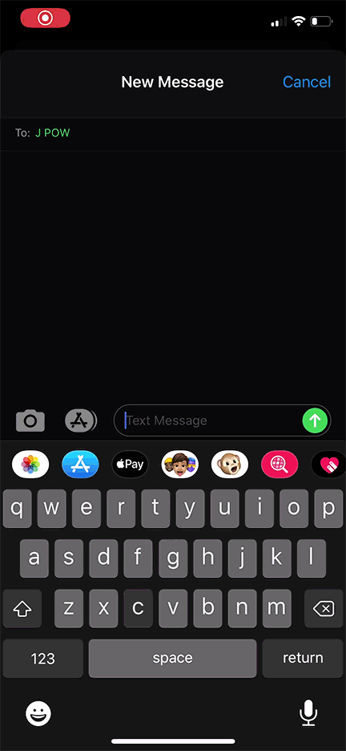

# A Texting Bot, providing Market Updates and COVID-19 Case Updates.
## Market Update

## COVID-19 Update

### How does it work?
A User simple needs to text 'market update' for a market update, or 'covid [territory]' for a covid update, where 'territory' can be any US state, or just 'USA' for 
the whole United States.
### Ok, but how does it WORK?
I used Twilio to get a number I could text from, connected to a webhook provided by me. Pythonanywhere is used to host the actual bot on a web server. I use twilio's API and flask to connect the python code to the bot, and I used a number of APIs to grab the market and COVID data. Market API: https://www.finnhub.io, COVID API: https://covidtracking.com/api
